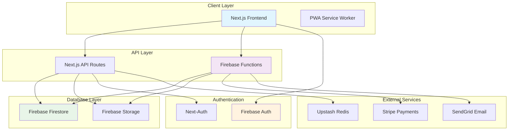

# X-Open-Network Deployment Guide

## Overview

This guide covers the deployment process for the X-Open-Network platform, including production deployment, development setup, and CI/CD pipeline configuration.

## Architecture



## Production Deployment

### Prerequisites

1. **Firebase Project Setup**
   - Create a Firebase project at https://console.firebase.google.com
   - Enable Authentication, Firestore, Functions, and Storage
   - Configure security rules for Firestore and Storage

2. **Environment Variables**
   - Copy `.env.example` to `.env.production`
   - Set all required environment variables:
     ```bash
     # Firebase Configuration
     NEXT_PUBLIC_FIREBASE_API_KEY=your_api_key
     NEXT_PUBLIC_FIREBASE_AUTH_DOMAIN=your_domain
     NEXT_PUBLIC_FIREBASE_PROJECT_ID=your_project_id
     NEXT_PUBLIC_FIREBASE_STORAGE_BUCKET=your_bucket
     NEXT_PUBLIC_FIREBASE_MESSAGING_SENDER_ID=your_sender_id
     NEXT_PUBLIC_FIREBASE_APP_ID=your_app_id
     
     # JWT Configuration
     JWT_SECRET=your_jwt_secret
     
     # Stripe Configuration
     STRIPE_SECRET_KEY=your_stripe_secret_key
     NEXT_PUBLIC_STRIPE_PUBLISHABLE_KEY=your_stripe_publishable_key
     
     # SendGrid Configuration
     SENDGRID_API_KEY=your_sendgrid_api_key
     
     # Upstash Redis
     UPSTASH_REDIS_REST_URL=your_redis_url
     UPSTASH_REDIS_REST_TOKEN=your_redis_token
     ```

### Deployment Steps

1. **Build the Application**
   ```bash
   npm run build
   ```

2. **Deploy to Firebase**
   ```bash
   # Deploy functions and database rules
   npm run deploy:prod
   
   # Or deploy specific services
   firebase deploy --only functions
   firebase deploy --only firestore:rules
   firebase deploy --only storage
   ```

3. **Deploy Frontend**
   - Configure your hosting provider (Vercel, Netlify, etc.)
   - Connect your repository
   - Set environment variables in the hosting dashboard
   - Deploy the Next.js application

### Firebase Functions Deployment

The application uses Firebase Functions for serverless backend processing:

```bash
# Deploy all functions
cd functions
npm run deploy

# Deploy specific function
firebase deploy --only functions:processStripeWebhook
```

### Database Migration

For database schema changes:

```bash
# Run migration script
npm run migrate:production

# Or manually apply Firestore rules
firebase deploy --only firestore:rules
```

## Development Environment

### Local Setup

1. **Install Dependencies**
   ```bash
   npm install
   cd functions && npm install
   cd ..
   ```

2. **Firebase Emulator Setup**
   ```bash
   # Install Firebase CLI
   npm install -g firebase-tools
   
   # Login to Firebase
   firebase login
   
   # Initialize emulators
   firebase init emulators
   ```

3. **Start Development Environment**
   ```bash
   # Start Firebase emulators
   firebase emulators:start
   
   # In another terminal, start Next.js
   npm run dev
   ```

### Development Workflow

1. **Code Changes**
   - Make changes to the codebase
   - Run tests: `npm test`
   - Run linting: `npm run lint`

2. **Testing**
   ```bash
   # Unit tests
   npm test
   
   # E2E tests
   npm run test:e2e
   
   # Test with emulators
   firebase emulators:exec "npm test"
   ```

3. **Build Verification**
   ```bash
   npm run build
   npm run type-check
   ```

## CI/CD Pipeline

### GitHub Actions Workflow

The project uses GitHub Actions for continuous integration:

```yaml
# .github/workflows/ci.yml
name: CI/CD Pipeline

on:
  push:
    branches: [ main, develop ]
  pull_request:
    branches: [ main, develop ]

jobs:
  test:
    runs-on: ubuntu-latest
    steps:
      - uses: actions/checkout@v4
      - name: Setup Node.js
        uses: actions/setup-node@v4
        with:
          node-version-file: '.nvmrc'
          cache: 'npm'
      - name: Install dependencies
        run: npm ci
      - name: Run tests
        run: npm run test:coverage
      - name: Build application
        run: npm run build

  deploy:
    needs: test
    runs-on: ubuntu-latest
    if: github.ref == 'refs/heads/main'
    steps:
      - uses: actions/checkout@v4
      - name: Deploy to Firebase
        run: npm run deploy:prod
```

### Pipeline Stages

1. **Build Stage**
   - Install dependencies
   - Run TypeScript compilation
   - Build Next.js application

2. **Test Stage**
   - Run unit tests with Jest
   - Run E2E tests with Playwright
   - Generate coverage reports

3. **Quality Gate**
   - ESLint checks
   - TypeScript type checking
   - Security scanning with Gitleaks

4. **Deploy Stage** (Production only)
   - Deploy Firebase Functions
   - Deploy Firestore rules
   - Deploy to hosting platform

## Security Considerations

### Authentication & Authorization

1. **Firebase Authentication**
   - Use Firebase Auth for user management
   - Implement role-based access control
   - Secure admin endpoints

2. **API Security**
   - JWT token validation
   - Rate limiting (implement with Upstash)
   - Input validation with Zod

3. **Database Security**
   - Firestore security rules
   - Data encryption at rest
   - Audit logging

### Environment Security

1. **Secret Management**
   - Never commit secrets to version control
   - Use environment variables for sensitive data
   - Rotate secrets regularly

2. **Network Security**
   - HTTPS everywhere
   - CORS configuration
   - CSP headers

## Monitoring and Observability

### Application Monitoring

1. **Error Tracking**
   - Sentry integration for error monitoring
   - Custom error boundaries
   - Structured logging

2. **Performance Monitoring**
   - Lighthouse CI for performance audits
   - Web vitals tracking
   - Firebase Performance Monitoring

3. **Business Metrics**
   - User analytics
   - Conversion tracking
   - Revenue monitoring

### Health Checks

```bash
# Application health check
curl https://your-domain.com/api/health

# Database connectivity
npm run health:db

# External service status
npm run health:external
```

## Backup and Recovery

### Database Backups

1. **Automated Backups**
   - Firebase automatic backups
   - Export collections regularly
   - Store backups securely

2. **Recovery Procedures**
   - Point-in-time recovery
   - Data restoration process
   - Disaster recovery plan

### Code Backup

1. **Repository Backup**
   - Multiple Git remotes
   - Regular repository mirroring
   - Code signing

## Performance Optimization

### Frontend Optimization

1. **Build Optimization**
   - Next.js optimization features
   - Code splitting
   - Image optimization

2. **Caching Strategy**
   - CDN caching
   - Browser caching
   - API response caching

### Backend Optimization

1. **Database Optimization**
   - Query optimization
   - Index management
   - Connection pooling

2. **Function Optimization**
   - Cold start optimization
   - Memory allocation
   - Timeout configuration

## Troubleshooting

### Common Issues

1. **Build Failures**
   - Check Node.js version compatibility
   - Verify environment variables
   - Review dependency conflicts

2. **Deployment Issues**
   - Firebase CLI authentication
   - Project permissions
   - Resource quotas

3. **Runtime Errors**
   - Database connection issues
   - API rate limits
   - Authentication failures

### Debug Commands

```bash
# Check Firebase project status
firebase projects:list

# Debug Firebase functions
firebase functions:log

# Test API endpoints
npm run test:api

# Check database connectivity
npm run debug:db
```

## Rollback Procedures

### Application Rollback

1. **Frontend Rollback**
   - Revert to previous deployment
   - Update environment variables
   - Clear CDN cache

2. **Backend Rollback**
   - Rollback Firebase Functions
   - Revert database schema changes
   - Update API documentation

### Emergency Procedures

1. **Complete System Rollback**
   - Activate maintenance mode
   - Revert all services
   - Notify stakeholders

2. **Partial Rollback**
   - Rollback specific components
   - Monitor system health
   - Gradual traffic restoration

## Maintenance

### Regular Maintenance Tasks

1. **Weekly Tasks**
   - Review error logs
   - Check performance metrics
   - Update dependencies

2. **Monthly Tasks**
   - Security audit
   - Backup verification
   - Performance optimization

3. **Quarterly Tasks**
   - Infrastructure review
   - Cost optimization
   - Security updates

## Support and Documentation

### Internal Documentation

- API documentation: `/docs/api.md`
- Development setup: `/docs/SETUP.md`
- Architecture decisions: `/docs/architecture/`

### External Resources

- Firebase Console: https://console.firebase.google.com
- Stripe Dashboard: https://dashboard.stripe.com
- Vercel Dashboard: https://vercel.com/dashboard

## Contact Information

For deployment issues or questions:
- Development Team: dev@x-open-network.com
- DevOps Team: devops@x-open-network.com
- Emergency Contact: oncall@x-open-network.com

---

Last updated: $(date)
Version: 1.0.0