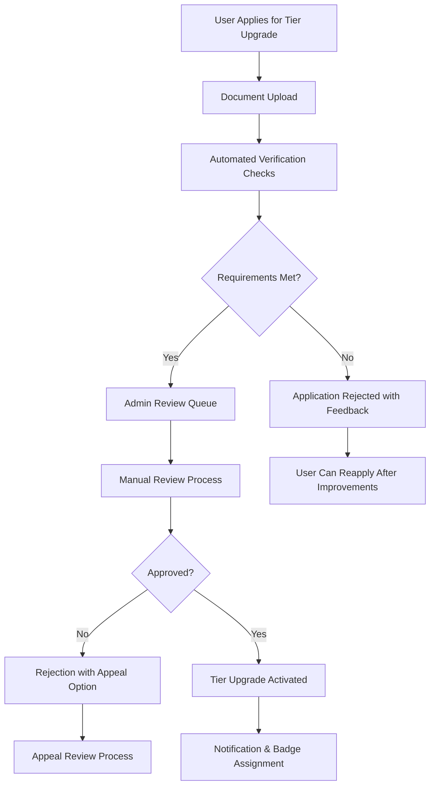

# AuditoryX Open Network - Tiers & Badges System

## 🏆 Overview

The AuditoryX tier system creates a trust-based hierarchy that enhances platform security, improves user experience, and enables premium features. Users progress through tiers based on verification, activity, and platform contributions, creating a reliable ecosystem for professional audio collaboration.

## 📊 Tier Comparison Matrix

| Feature | Standard Tier | Verified Tier | Signature Tier |
|---------|---------------|---------------|----------------|
| **Trust & Identity** |
| Profile Badge | None | ✅ Blue checkmark | ⭐ Gold star |
| Identity Verification | Email only | Government ID + Profile | Professional validation |
| Trust Score Boost | Baseline (0-20) | +20 points | +50 points |
| **Exposure & Discovery** |
| Search Ranking | Baseline | +1 rank weight | Top-of-feed priority |
| Featured Placement | No | Limited | Homepage features |
| Profile Visibility | Standard | Enhanced | Premium showcase |
| **Booking Capabilities** |
| Monthly Bookings (Client) | 5 | 25 | Unlimited |
| Monthly Bookings (Creator) | Unlimited | Unlimited | Unlimited |
| Split-Booking Support | ❌ Single person | ✅ Up to 5 people | ✅ Unlimited collaborators |
| Team Management | No | Basic | Advanced tools |
| **Financial Benefits** |
| Platform Fee | 5% | 5% | 2.5% (50% reduction) |
| Payout Speed | T+7 days | T+3 days | T+1 same day |
| Payment Methods | Cards only | All methods + ACH | Priority processing |
| Escrow Terms | 7-day minimum | 3-day minimum | Flexible terms |
| **Communication & Support** |
| Chat Features | Basic messaging | Encrypted chat | Premium encryption |
| Support Level | Email only | Live chat | 24/7 phone + priority |
| Response Time | 24-48 hours | 4-8 hours | <2 hours |
| **Tools & Features** |
| Calendar Integration | ❌ Manual only | ✅ Google Calendar | ✅ Advanced sync |
| Analytics Dashboard | Basic metrics | Professional insights | Enterprise-grade |
| API Access | No | No | ✅ Full platform API |
| Custom Branding | No | No | ✅ White-label options |
| **Limits & Quotas** |
| Portfolio Items | 10 | 50 | Unlimited |
| File Storage | 1GB | 5GB | 25GB |
| Video Uploads | 5 minutes max | 15 minutes max | 60 minutes max |
| Cancellation Window | 48 hours | 24 hours | Flexible |

## 🎯 Tier Progression Requirements

### 🥉 Standard Tier (Default)
**Entry Requirements:**
- ✅ Email verification (required)
- ✅ Basic profile completion (20% minimum)
- ✅ Platform agreement acceptance

**Capabilities:**
- Profile creation and browsing
- Send/receive booking requests (5/month limit)
- Basic messaging and chat
- Upload portfolio items (10 max)
- Single-person bookings only

**Limitations:**
- No identity verification required
- No collaboration features
- Basic analytics only
- Standard support response times

### ✅ Verified Tier (Trust Enhanced)
**Unlock Requirements:**
1. **Identity Verification**: Government-issued ID upload via Stripe Identity
2. **Profile Completion**: 90% profile completeness including:
   - Professional bio (150+ words)
   - Service descriptions
   - Portfolio with 5+ items
   - Pricing information
3. **Platform Activity**: Complete 3 successful bookings with positive reviews
4. **Community Standing**: No active disputes or policy violations
5. **Admin Review**: Manual verification process (1-3 business days)

**Enhanced Capabilities:**
- Blue checkmark verification badge
- Split payments for collaborative projects
- Team booking coordination (up to 5 people)
- Priority search result placement
- Google Calendar integration
- End-to-end encrypted messaging
- Professional analytics dashboard

**Trust Signals:**
- Government ID verified
- Phone number confirmed
- Email verified
- Professional portfolio reviewed
- Positive review history

### 🌟 Signature Tier (Premium Professional)
**Unlock Requirements:**
1. **Verified Status**: Must achieve Verified tier first
2. **Revenue Threshold**: $10,000+ in completed platform transactions
3. **Activity Level**: 50+ completed bookings with 4.8+ average rating
4. **Community Leadership**: 
   - Mentor other creators
   - Contribute platform feedback
   - Positive community impact
5. **Professional Validation**: Portfolio review by platform curators
6. **Subscription**: $99/month or $999/year subscription fee

**Exclusive Benefits:**
- Gold star signature badge
- Reduced platform fee (2.5% vs 5%)
- Featured homepage placement
- Same-day payment processing
- Unlimited collaborators per project
- 24/7 priority support with dedicated account manager
- Full platform API access
- White-label branding options
- Beta feature access
- Exclusive networking events

## 🔄 Tier Upgrade Process

### Application Workflow



### Review Timeline
- **Standard → Verified**: 1-3 business days
- **Verified → Signature**: 3-5 business days  
- **Appeals Process**: 5-7 business days

### Approval Criteria

**Verified Tier Approval:**
✅ **Identity Verification**
- Government ID matches profile information
- Clear, unaltered document images
- Valid and non-expired identification

✅ **Profile Quality Assessment**
- Professional profile photo
- Comprehensive service descriptions
- High-quality portfolio samples
- Complete contact information

✅ **Platform Behavior Review**
- No policy violations or disputes
- Positive communication patterns
- Timely responses to inquiries
- Professional conduct standards

**Signature Tier Approval:**
✅ **Financial Performance**
- Consistent revenue generation
- Professional pricing strategy
- Reliable transaction history

✅ **Professional Excellence**
- Industry credentials or experience
- Portfolio with detailed case studies
- Client testimonials and references
- Thought leadership or teaching

✅ **Community Leadership**
- Mentor new platform members
- Constructive platform feedback
- Positive impact on creator community

## 🏅 Badge Display & Filtering

### Badge Visual Design

**Verified Badge (✅)**
- Blue checkmark icon
- Displays next to creator name
- Visible in search results, profiles, and messages
- Tooltip: "Identity verified through government ID"

**Signature Badge (⭐)**
- Gold star icon with subtle animation
- Premium placement in search results
- Exclusive signature portfolio layouts
- Tooltip: "Premium professional with proven track record"

### Search & Discovery Filtering

**Filter Options:**
- **All Creators**: Default view including all tiers
- **Verified Only**: Show only Verified and Signature creators
- **Signature Only**: Premium creators exclusively
- **Trust Score Range**: Advanced filtering by computed trust scores

**Smart Matching Algorithm:**
```typescript
interface TrustScore {
  baseTierScore: number;      // Standard: 0, Verified: 20, Signature: 50
  verificationBonus: number;  // +10 for each verification type
  reviewScore: number;        // (Average rating * 20)
  activityScore: number;      // Based on platform engagement
  expertiseScore: number;     // Based on portfolio and specialization
  total: number;             // Sum of all components (max 100)
}
```

## 📈 Analytics & Performance Tracking

### User Dashboard Metrics
- Current tier status and progression
- Requirements checklist for next tier
- Verification document status
- Booking statistics and revenue
- Community reputation scores
- Trust score breakdown

### Platform Analytics
- Tier distribution across user base
- Conversion rates between tiers
- Feature adoption by tier level
- Revenue generation by tier
- Support ticket volume analysis
- Upgrade success factors

### Automated Notifications
- Eligibility alerts for tier advancement
- Verification requirement reminders
- Achievement celebrations
- Tier benefit announcements
- Performance milestone notifications

## 🎯 Business Impact & ROI

### Revenue Model
- **Standard Users**: Platform transaction fees (5%)
- **Verified Users**: Enhanced transaction fees (5%) + increased GMV
- **Signature Users**: Subscription revenue ($99/month) + reduced fees (2.5%) + premium services

### Expected Outcomes
- **Higher Trust**: Verified identity reduces fraud and disputes
- **Increased GMV**: Premium tiers drive higher-value transactions
- **User Retention**: Tier progression creates platform stickiness
- **Quality Control**: Verification ensures professional standards
- **Premium Revenue**: Subscription fees from power users

### Success Metrics
- **Tier Upgrade Rate**: Target 15% Standard → Verified, 5% Verified → Signature
- **Revenue per User**: 3x higher for Signature vs Standard users
- **Dispute Rate**: 80% reduction for Verified+ transactions
- **User Satisfaction**: 4.5+ rating across all tier interactions

---

**Related Documentation:**
- [Executive Overview](./executive-overview.md) - Complete platform overview
- [Architecture Diagram](./architecture-diagram.png) - Technical implementation
- [User Interface Screenshots](./screenshots/) - Visual tier examples
- [Implementation Guide](../TIER_SYSTEM.md) - Technical tier system details